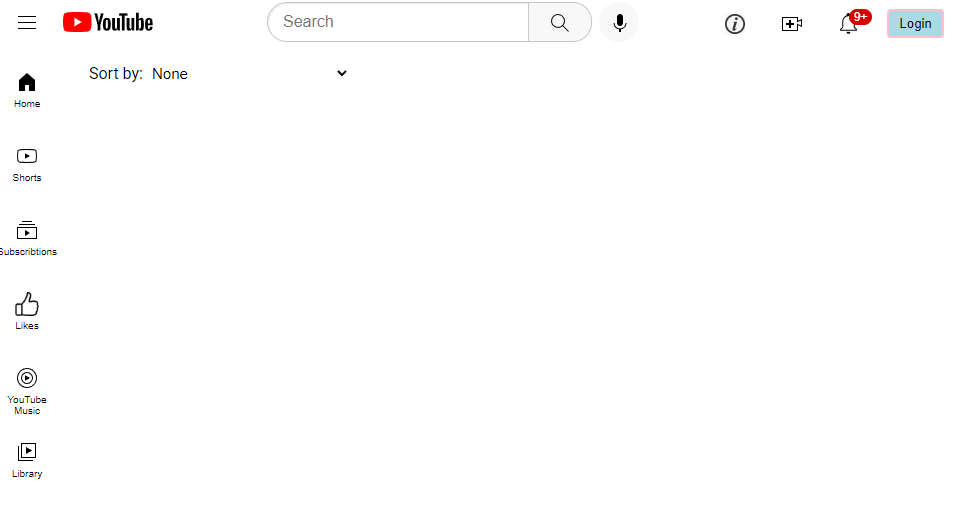
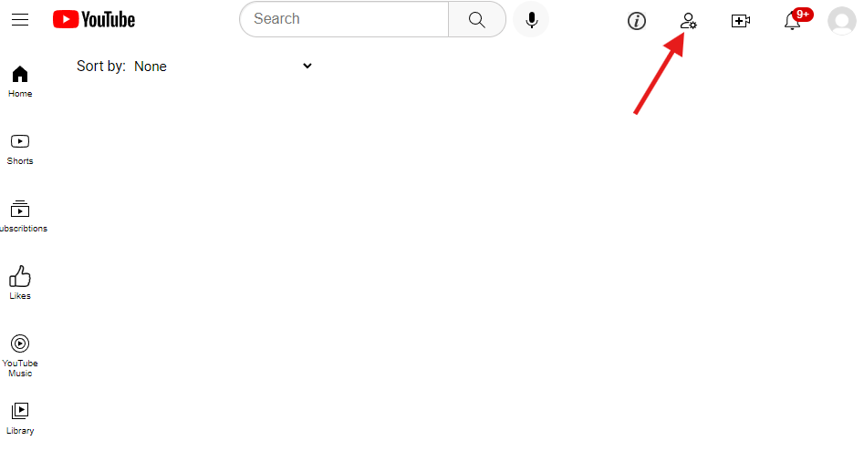
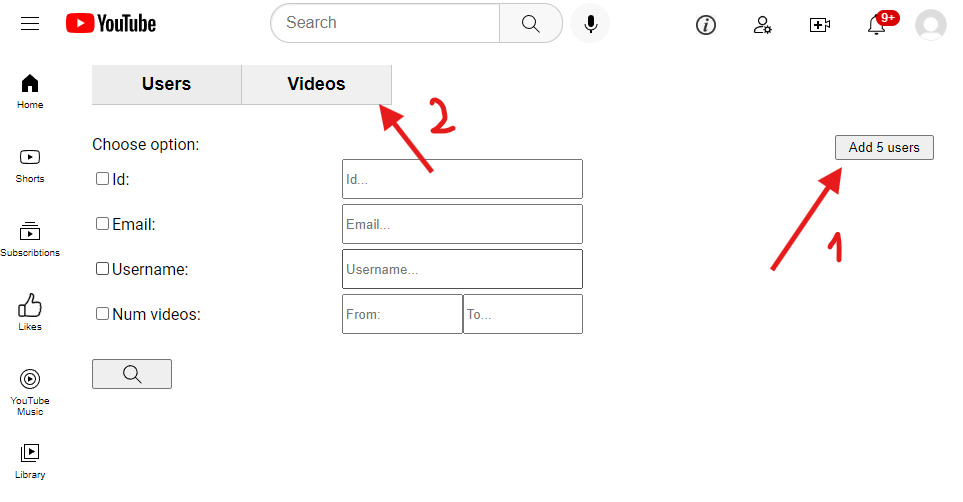
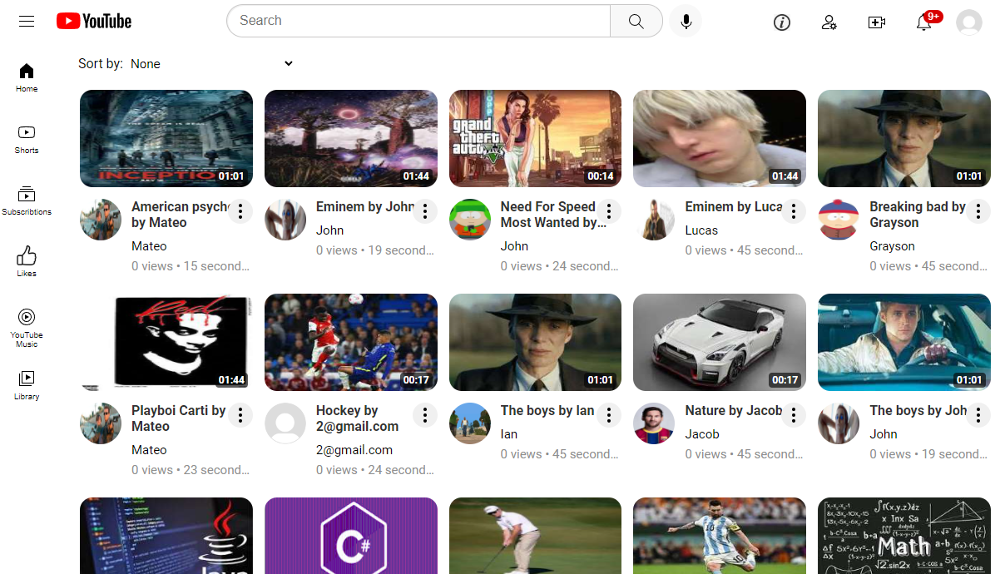
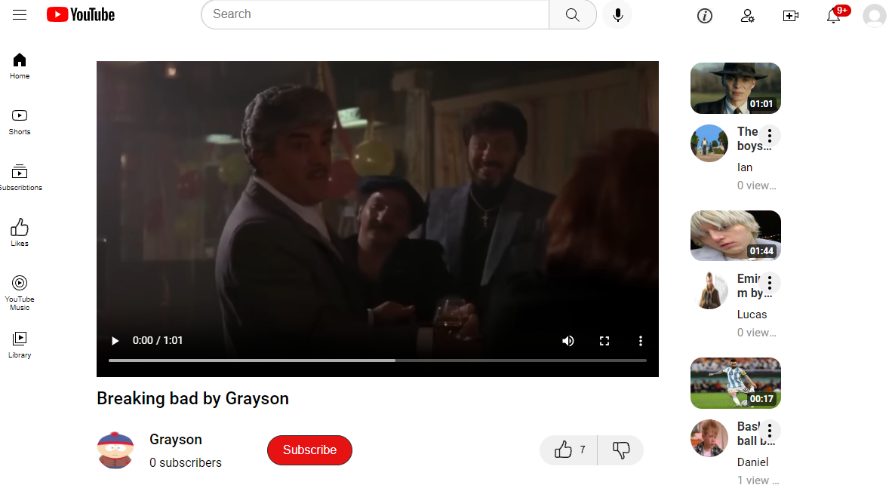
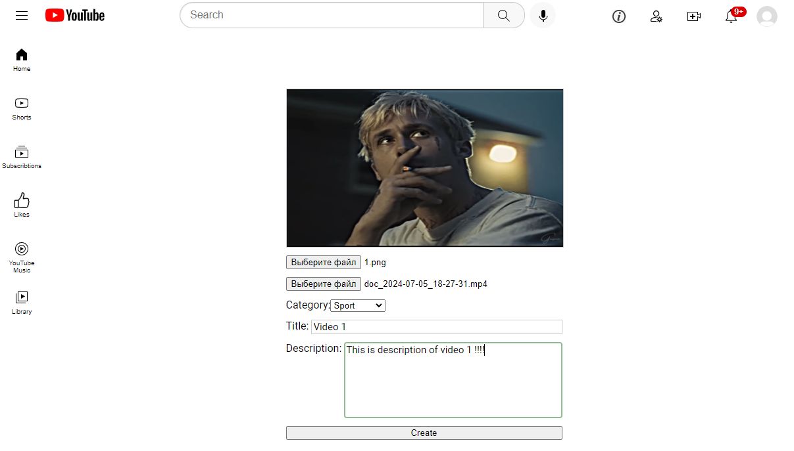

# Application testing guide

This document provides step-by-step instructions on how to test the application.

## Prerequisites

 - application started

## Steps to test the application

 - after you start the application you will see an empty page

    

 - click on the login button in the upper right corner and create test user with random email and password. You will be redirected to home page

 - for test purposes every new user has admin role by default, so you can use the admin page. Click on the corresponding button in the upper right corner

    

 - here you can see many search string that allows to find users by multiple criteria. Also you can find a button to create a dummy users. Press on this button several times. Then switch to the video tab and do the same

    

 - go to the main page, there you can see all created videos

    

 - click on any video to watch it. You can see that video is retreiving by parts

    

 - to upload yout own video click on corresponding button in upper right corner. Here you can attach thumbnail and video, and fill other fields. Video will be converted to hls format

    